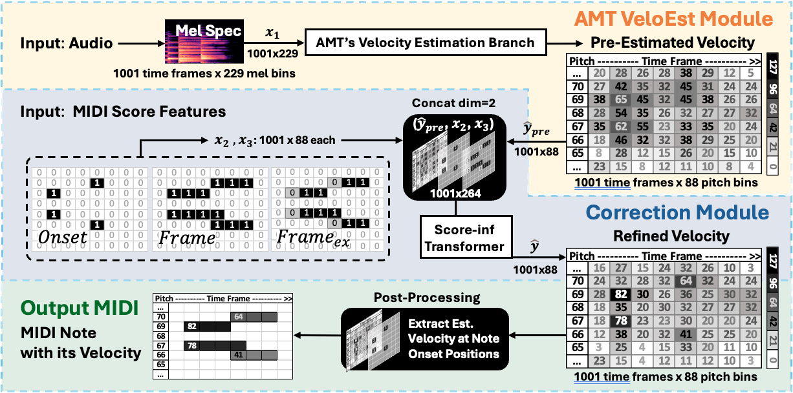

# Score-Informed AMT Velocity Estimation
This repo is the code of paper submitted to SMC2026, "Score-Informed Transformer for Refining MIDI Velocity in Automatic Music Transcription", a PyTorch implementation which use the MIDI score to estimate the MIDI velocity from MIDI score + audio.

<p align="center">
  
</p>

It supports:
- AMT's velocity estimation branch: `hpt`, `hppnet`, `dynest`
- Reproduce AMT's performance with `direct` mode OR apply score-informed module `note_editor` (a lightweight Transformer encoder)
- Evaluation our methods with MAESTRO v3 / SMD / MAPS datasets.
- **Practical application: use the above on your own data (xxx.mid + xxx.wav, see [Sec 6 Inference](#6-inference)).**

You can find our paper results on our jupyter notebook:
- [`Train.ipynb`](./Train.ipynb): Figure 2 is extracted from our [open-available wandb records](https://wandb.ai/zhanh-uwa/202602_smc?nw=nwuserzhanh).
- [`Test.ipynb`](./Test.ipynb): Tables 1 and 2 

The training takes 8~16 GiB GPU memory, inference takes less than 1 GiB.
## 1. Dataset Preparation
Download datasets:
- MAESTRO v3.0.0: https://magenta.tensorflow.org/datasets/maestro
- Saarland Music Data (v2): https://zenodo.org/records/13753319
- MAPS: official old public link is broken; contact us to share

## 2. Environment Setup
Tested on Ubuntu 22.04 with CUDA 11.8 ~ 12.4, Python 3.10, PyTorch 2.2. Should able to support upper version.

```bash
conda env create -f environment.yaml
conda activate hpt_env
wandb login
```

Edit [`pytorch/config/config.yaml`](./pytorch/config/config.yaml) before running anything:
- `exp.workspace` (where hdf5/checkpoints/logs/eval outputs are stored)
- `dataset.maestro_dir`
- `dataset.smd_dir`
- `dataset.maps_dir`
- and others

## 3. Pack Datasets to HDF5
Our experiments use 22.05kHz sampling rate.
```bash
python pytorch/data_generator.py pack_maestro_dataset_to_hdf5 feature.sample_rate=22050

python pytorch/data_generator.py pack_smd_dataset_to_hdf5 feature.sample_rate=22050

python pytorch/data_generator.py pack_maps_dataset_to_hdf5 feature.sample_rate=22050
```
If want to use the benchmark pretrained models:
- Transkun: 44.1kHz: feature.sample_rate=44100
- FiLMUnet: 16kHz: feature.sample_rate=16000


## 4. Train
Notebook path [`Train.ipynb`](./Train.ipynb). Modify `model.name` to 'hpt', 'hppnet', 'dynest' to examinate different AMT's Velocity Estimation branches.

Single GPU examples:
```bash
# AMT Direct (no score-informed module)
python pytorch/train_score_inf.py \
  model.type=hpt score_informed.method=direct \
  model.input2=null model.input3=null

# AMT + Score-informed Transformer (proposed)
python pytorch/train_score_inf.py \
  model.type=hpt score_informed.method=note_editor \
  model.input2=onset model.input3=frame
```

Dual GPU (example for `scrr` - not included in our SMC paper):
```bash
torchrun --standalone --nnodes=1 --nproc_per_node=2 \
  pytorch/train_score_inf_dual.py \
  +exp.use_fsdp=true \
  model.type=hpt score_informed.method=scrr \
  model.input2=onset model.input3=exframe
```

Method/input compatibility:
- `direct`: no score conditioning (`input2/input3` ignored).
- `note_editor`: use `model.input2=onset`; `model.input3` can be `null|frame|exframe`.
- `bilstm`, `dual_gated`, `scrr`: legacy options, not used in our SMC paper.

## 5. Evaluation (Paper Tables 1&2)
Notebook path [`Test.ipynb`](./Test.ipynb). This files has recorded all results in our Paper.

## 6. Inference
Script entry: `pytorch/inference.py`. Use this file to do inference on your own data, which expects paired audio+midi files with the same basename (e.g., `xxx.wav` + `xxx.mid`).
```bash
python pytorch/inference.py \
  --mode single \
  --input-path /path/to/audio_or_midi_file \
  --output-path /path/to/output.mid \
  --midi-format smd \
  --overrides model.type=hpt model.pretrained_checkpoint=/path/to/checkpoint.pth
```

## Contact and Acknowledgment
Due to the large size of pretrained model, you can contact us via email to obtain these ckpt files. Contact: zhanh.he.uwa@gmail.com

Acknowledgment: 
- We thank Hyon Kim et al. (ISMIR 2024, FiLM-UNet) for sharing their code and pretrained checkpoints!
- We thank Yujia Yan et al. (ISMIR 2024, Transkun v2) for open-source their code and pretrained checkpoints!